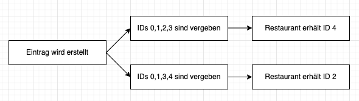
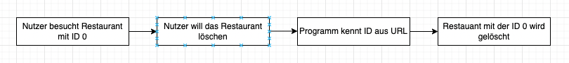
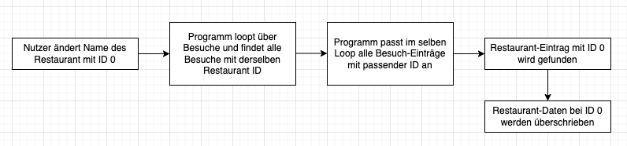

# RestaurantSnackTracker

## Grundidee
Der *Restaurant SnackTracker* erlaubt es dem Nutzer, einen Überblick über seine vergangenen Restaurantbesuche zu erlangen. 
Es ist dem Nutzer möglich, die Restaurantbesuche anhand verschiedener Faktoren zu bewerten. Basierend auf diesen Besuchen
werden Statistiken zu den jeweiligen Restaurants erstellt, die sich aus den einzelnen Besuchen ergeben.

Damit soll dem Nutzer eine Datenbasis bereitgestellt werden, die er für die Besuche von Restaurants in der Zukunft zurate ziehen kann.

## Daten

### Grundsätzliches

Zunächst wird der Nutzer Restaurants anlegen, wenn er diese besucht - sofern sie noch nicht in der Datenbank bestehen. 
Der Nutzer kann dem Restaurant ein paar Stammdaten zuweisen. Damit wird es ihm ein leichtes sein, das Restaurant zu finden,
falls er dort wieder mal essen will.

Der Nutzer kann auch neue Besuche anlegen. Es ist dem Nutzer nicht möglich, neue Besuche anzulegen, ohne ein Restaurant auszuwählen. 
Besuche müssen einem Restaurant zugeordnet sein. Falls keine Restaurants bestehen und der Nutzer einen Besuch anlegen will, 
wird er durch eine Meldung aufgefordert, zuerst ein Restaurant anzulegen. 

Der Nutzer kann dann für den Besuch ein Restaurant auswählen und dem Besuch gewisse Werte zuordnen. Damit soll erfasst werden,
wie der Besuch war und was konsumiert wurde.

### Restaurant-Datenbank
Jeder Eintrag in der Restaurant-Datenbank enthält folgende Informationen

- Name des Restaurants
- Adresse, PLZ, Ort
- Cuisine (Italienisch, Lokal, Döner etc)

### Besuch-Datenbank
Jeder Eintrag in der Besuche-Datenbank enthält folgende Informationen

- Restaurant
- Datum
- Gewählte Speise
- Gewähltes Getränk
- Was der Besuch gekostet hat
- Bewertung des Essens
- Bewertung des Service
- Bewertung des Preis-Leistung-Verhältnis (=Value)

### Format der Daten

Der RestaurantSnackTracker bedient sich dem Datenformat JSON für die Datenbanken. Grund dafür ergibt sich aus der ausgesprochen
einfachen Syntax und der Darstellung und aus der Darstellung, die an Datenstrukturen wie Python-Dictionaries oder JS-Objects erinnert.
.csv wurde auch ausprobiert, schnell jedoch zugunsten von JSON abgeschafft.

## Dateneingabe

Die Dateneingabe erfolgt über HTML-Forms. Im Frontend findet eine Validation statt - alle Eingabewerte müssen die richtige Art sein
(zB PLZ sind immer Zahlenwerte). Der Nutzer kann auch kein Eingabefeld überspringen, inkomplette Formulare werden nicht abgeschickt.

Der Nutzer kann Daten eingeben, in dem er neue Besuche oder Restaurants erstellt. Buttons dazu finden sich immer an Stellen, wo dies Sinn ergibt.
Beispiel wäre etwa die Ansicht eines Restaurants - der Nutzer kann direkt hier per Button direkt für dieses Restaurant einen Besuch hinzufügen.

Nutzer machen aber auch Fehler. Oder vielleicht kriegt der Nutzer nach erster Bewertung des Besuchs Magenprobleme, und will darum die Bewertung 
nach unten korrigieren. Es könnte auch sein, das ein Restaurant den Standort wechselt. Für diese Fälle ist vorgesorgt - der Nutzer kann 
sowohl die Daten zu Besuchen als auch zu Restaurants abändern. Die Formulare dazu enthalten jeweils zur Nutzerfreundlichkeit die bisherigen Daten.

## Datenverarbeitung

### Grundsätzliches

Die Funktionsweise des RestaurantSnackTracker erfordert ein enges Zusammenspiel zwischen Daten aus zwei Datenbanken. 
Besondere Herausforderung in der Programmierung stellte dar, dass die Veränderung von Restaurantdaten (zB Namensänderung)
auch Einfluss auf die Besuchsdaten hat. Jeder Besuch speichert auch Name des Restaurants - wenn also der Nutzer einen Namen ändert,
so sollte dies auch den Namen des Restaurants in den dazugehörigen Besuchen anpassen. 

### Das ID-System

Zur eindeutigen Zuordnung der Restaurants und Besuche wird jeweils bei der Erstellung eine ID vergeben. Diese ID ist dem Nutzer
aber nicht wirklich zugänglich - einzig in der URL findet sie sich. Beispiel: Wenn Restaurant Hu Xin ID 0 hat, so ist der Link dafür
/restaurant/0. Die ID wird mit Erstellung generiert und ist immer die niedrigste verfügbare Zahl. Wenn etwa Restaurants mit ID 0,1,2 bestehen
und Restaurant mit ID 1 gelöscht wird, so bleiben die IDs 0 und 2 bestehen. Bei der Erstellung eines neuen Restaurants wird dann die ID 1 vergeben,
die zuvor frei geworden ist.

Dieses ID-System erlaubt eine einfache Gestaltung von Funktionen, die zur Verarbeitung von Daten die betroffenen Einträge immer per ID finden können
und dann entsprechend Werte auch anpassen oder löschen können.

### Datenänderungen in beiden Datenbanken

Wie bereits oben touchiert, können manche Dateneingaben Einfluss auf beide Datenbanken nehmen. Beispiel wäre das Ändern eines
Restaurant-Namens. Die dazugehörigen Besuche müssen angepasst werden. Zuerst loopt das Programm über alle Besuche und findet diejenigen,
deren Restaurant ID mit der ID des bearbeiteten Restaurants übereinstimmt. Bei diesen Anträgen wird der Restaurant-Name angepasst.
Danach loopt das Programm über die Restaurants und ändert den Restaurant-Namen bei dem Eintrag, der die passende ID hat.

Ähnlich verhält es sich etwa beim Löschen von Restaurants - die dazugehörigen Besuche werden dann auch gelöscht. Wenn also Restaurant
mit ID 0 gelöscht wird, so werden auch alle Besuche gelöscht, deren Eintrag Restaurant ID 0 vorweist.

## Datenausgabe

Basierend auf den bestehenden Datenbanken werden nun auch diese Daten sichtbar gemacht. 

### Restaurant-Liste

Die Restaurant-Liste zeigt dem Nutzer alle Restaurants an. Die Stammdaten sollen eine Übersicht erlauben - 
so kann der Nutzer sehen, wie das Restaurant heisst und wo es sich befindet.

Im Schnellzugriff rechts befinden sich ausserdem Buttons, welche verschiedene Restaurant-bezogene Aktionen erlauben:
- Restaurant anzeigen > *führt zur Subpage des spezifischen Restaurants, wo mehr Informationen sind*
- Besuch zu dem Restaurant hinzufügen > *öffnet Formular zum Erstellen eines neuen Restaurants*
- Restaurant-Details ändern > *Öffnet Formular zum Ändern der Restaurant-Details*
- Restaurant löschen > *löscht das Restaurant und alle dazugehörigen Besuche*

### Ansicht eines Restaurants

Diese Ansicht zeigt Informationen zu einem spezifischen Restaurant. Zuerst erscheinen wieder nützliche Buttons für verschiedene Aktionen.
Danach werden Fakten und Statistiken dargestellt. Die Statistiken sind mehr oder weniger einfach die Anzahl der Besuche und 
durchschnittlicher Preis, Wartezeit und die drei Ratings. Diese Durchschnitte werden aufgrund aller für das Restaurant erstellten Besuche
berechnet. Wenn der Nutzer einen Besuch ändert, kann er direkt danach seine neu berechneten Werte sehen.

Weiterhin kann der Nutzer hier zum Restaurant-Vergleich navigieren. Dazu kann ein anderes Restaurant im
Dropdown ausgewählt werden und auf "Vergleich!" geklickt werden. Die beiden Restaurants werden dann auf
einer neu öffnenden Subpage verglichen.

### Restaurant-Vergleich

Der Restaurant-Vergleich nimmt die Statistiken von zwei Restaurants und stellt diese gegenüber. So kann der Nutzer
sich vielleicht einfacher entscheiden, welches Restaurant von beiden ihn eher anspricht. Man sieht etwa, welches 
günstiger ist, wo man weniger wartet, wo das Essen besser ist und so weiter.

Dabei kann der Nutzer auch gleich zu jedem der Restaurants navigieren, falls man weitere Informationen möchte - 
etwa eine Übersicht zu anderen Besuchen dort oder falls man einen neuen Vergleich starten möchte.

### Frontage

Die Frontpage erlaubt nicht nur schnellen Zugriff zu nützlichen Aktionen (etwa dem Hinzufügen von neuen Anträgen),
sondern zeigt auch eine Übersicht von vieler der angesprochenen Daten und Statistiken. Diese widerspiegeln sich in Form 
von drei Listen mit drei Einträgen:

- Drei letzte Besuche (nach Besuchsdatum)
- Top 3 Restaurants sortiert nach bestem Essen
- Top 3 Restaurants nach bestem "Value" (Preis-Leistung-Verhältnis)

Die drei letzten Besuche sollen in Erinnerung rufen, wo der Nutzer zuletzt war und wie das Essen war. Der Nutzer kann
dann auch gleich zum Restaurant navigieren, um mehr über das Restaurant zu erfahren.

Die Top 3 Restaurants nach Essensdurchschnitt zeigen auch an, wie lange man warten muss. Vielleicht soll es ja schnell gehen
und lecker sein. Auch hier kann der Nutzer direkt zum Restaurant navigieren.

Die Top 3 "Value" sind gedacht, falls der Nutzer mal nicht viel Geld ausgeben will. So sieht er, welches Restaurant das
beste Preis-Leistung-Verhältnis hat. Da ein gutes solches Verhältnis nicht zwingendermassen einen niedrigen Preis
mit sich bringt, kann der Nutzer auch den Durchschnittspreis sehen und so ein günstiges Restaurant finden.

## Was könnte verbessert werden?

Vieles. Ein paar Punkte möchte ich ansprechen:
- Nutzerfreundlichere Navigation (zB Buttons, die zurück zur vorherigen Page führen beim Edit eines Besuchs)
- Mehr Feedback (zB "Änderungen wurden gespeichert" oder "Besuch wurde gelöscht")
- Einheitlichere Darstellung (zB Stern-Ratings überall statt nur bei den Besuchen)
- Warning prompts, etwa dass etwas endgültig gelöscht wird
- Weitere Statistiken, etwa sortieren nach verschiedenen Merkmalen (zB Preis auf- und absteigend)

Die meisten dieser Funktionen sind nicht vorhanden, weil sie nach meinem Verständnis ausserhalb des "Scopes"
einer solchen Arbeit stehen. Ob ich das richtig einschätze, sehen wir dann bei der Bewertung ;)

## Schlusswort

Diese Arbeit hat mir viel Spass bereitet. Grundsätzlich programmiere ich gerne, in der Regel Webentwicklung basierend auf
NodeJS und andere kleine JS-Scripts. Flask und Python zu verwenden war aber eine spannende Herausforderung.

Insbesondere bei weniger komplexen Projekten könnte ich mir durchaus vorstellen, wieder Python und Flask zu verwenden.
Es lässt sich wirklich schnell viel erreichen. Nicht dass ich damit sagen will, Python kann nicht komplex sein.
Ich fühle mich einfach noch sicherer mit NodeJS, falls es herausfordernder wird.

